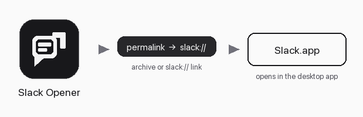

# Slack Opener

Clicks on `slack://` inside the editor do nothing — VS Code will not own
that scheme. This extension opens Slack.app via `vscode.env.openExternal`,
same as `open 'slack://…'` on macOS.



## What it does

| Surface | Behavior |
|---|---|
| Command Palette → **Slack: Open Slack URL** | Prompt; prefills selection or clipboard if it looks like Slack |
| `slack://…` or `https://….slack.com/archives/…` in a **file** | Clickable; runs the command (does not use `slack:` as a document URI) |
| Same links in the **terminal** | Click → Slack.app |
| `vscode://codenoevil.slack-opener/open?u=…` | UriHandler for anything that can emit a `vscode://` link |

It does **not** intercept markdown preview or chat-webview clicks on raw
`slack://`. Use an https archive permalink and run **Slack: Open Slack URL**
(clipboard), or put the link in a file/terminal.

## Converted URL

```
https://acme.slack.com/archives/C01234567/p1234567890123456
  → slack://channel?team=T01234567&id=C01234567&message=1234567890.123456
```

Set `slackOpener.teamId` to your workspace team ID when an archive
permalink has none. The team ID is the `T…` value in a `slack://` URL.

## Install

Repo: [CodeNoEvil/vscode-slack-opener](https://github.com/CodeNoEvil/vscode-slack-opener)

Either download the latest `slack-opener-*.vsix` from **Actions → package
→ artifacts** on `main`, or build it:

1. Node 20+.
2. Clone and build the VSIX:

   ```bash
   git clone git@github.com:CodeNoEvil/vscode-slack-opener.git ~/src/vscode-slack-opener
   cd ~/src/vscode-slack-opener
   npm install
   npm test
   npm run package
   ```

3. Install it:

   ```bash
   code --install-extension slack-opener-0.1.1.vsix
   ```

   Or **Extensions → … → Install from VSIX…**. Then **Developer: Reload Window**.

   If you previously installed via symlink
   (`~/.vscode/extensions/davidbitton.slack-opener-0.1.0`), remove that
   first so VS Code does not keep the old publisher id.

4. Settings (`Slack Opener`):

   | Setting | Default | Meaning |
   | --- | --- | --- |
   | `slackOpener.teamId` | _(empty)_ | Workspace team ID when an archive permalink has none. |

## Use

- Command Palette: **Slack: Open Slack URL**
- Click a Slack permalink or `slack://` link in a file or the terminal
- From anything that can emit a URI:
  `vscode://codenoevil.slack-opener/open?u=https%3A%2F%2Facme.slack.com%2Farchives%2F…`

F5 from this folder still works (Extension Development Host).
